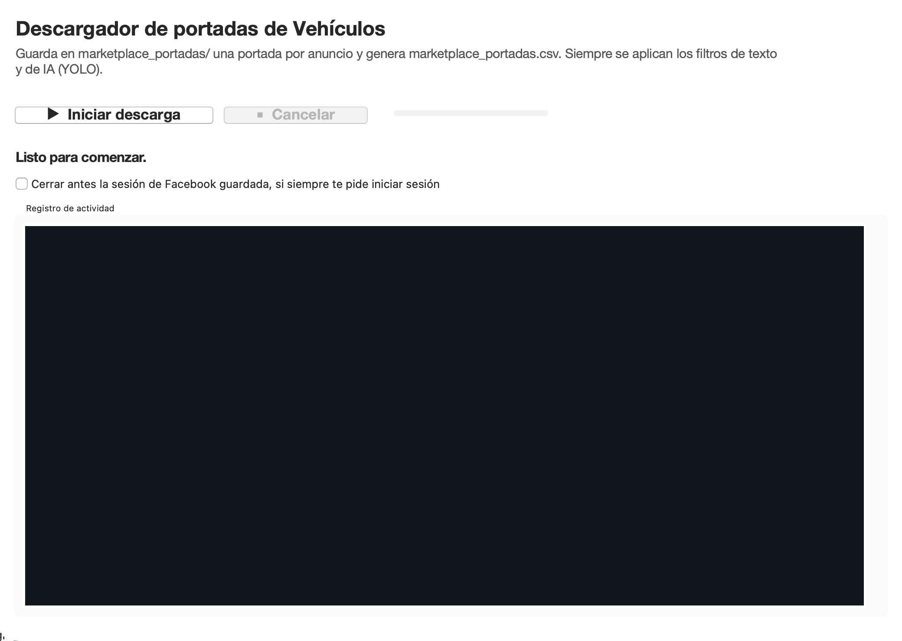
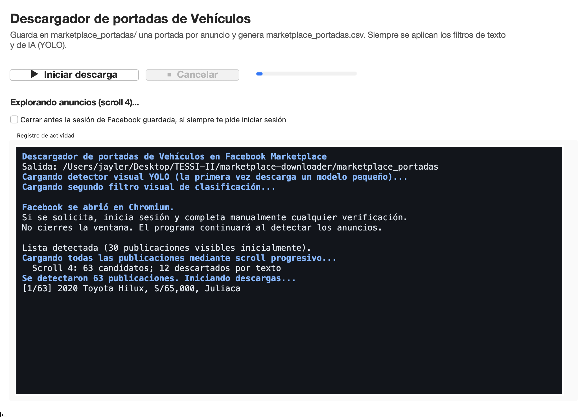
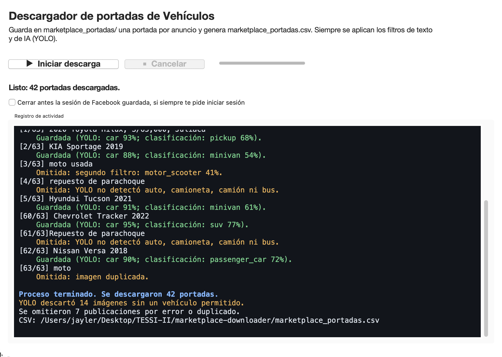
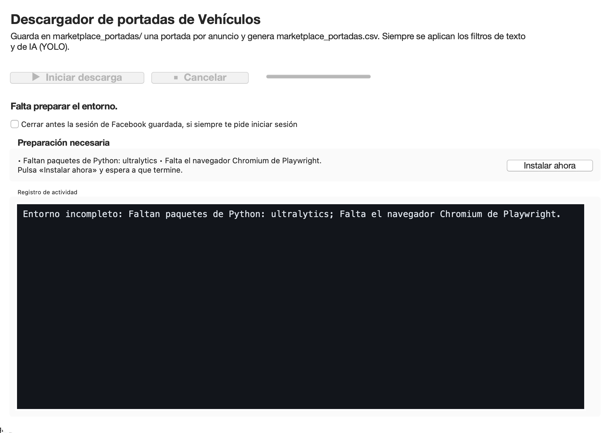
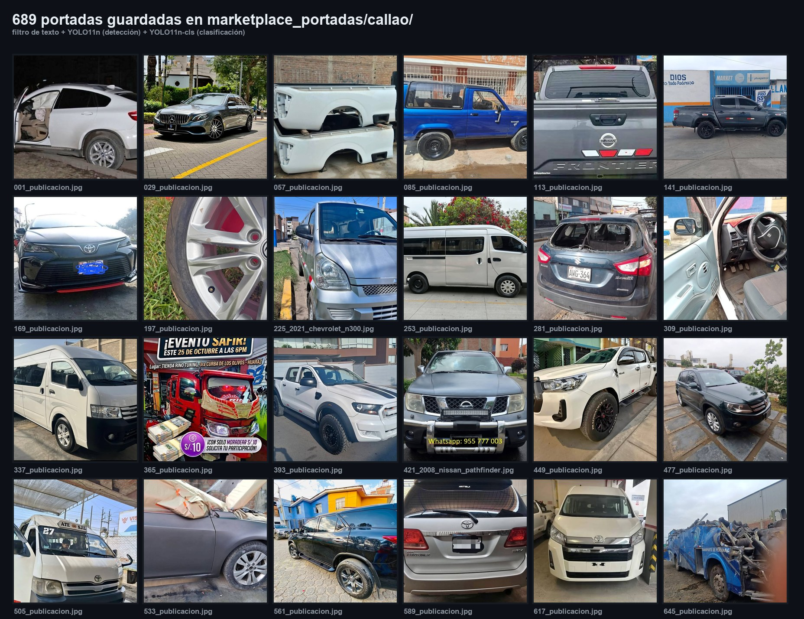
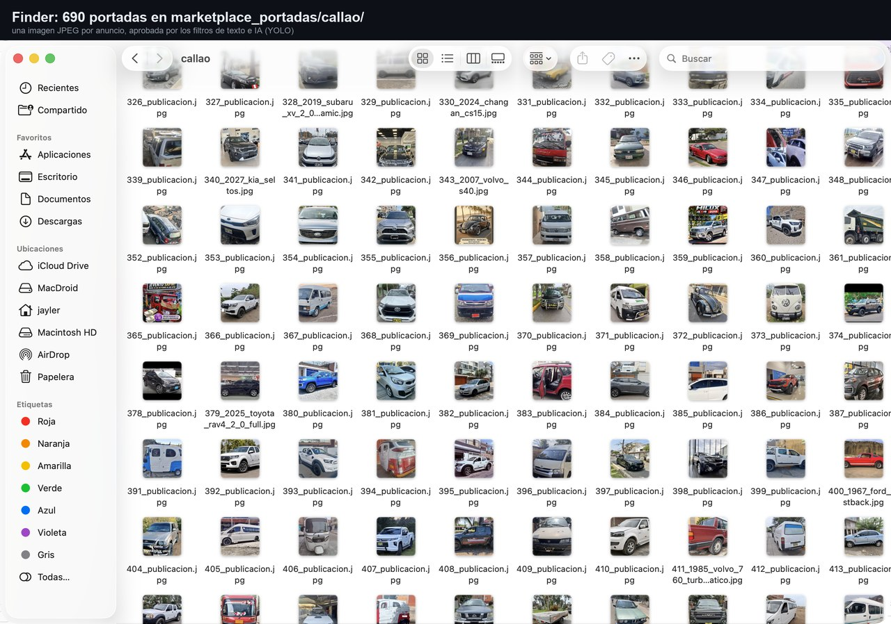

# Vehicle Cover Downloader · filtro YOLO

Descargador de portadas de **vehículos** de Facebook Marketplace para macOS, con interfaz
gráfica y filtro local de IA. Baja una imagen por anuncio, se queda solo con
**automóviles, camionetas, camiones y buses** (cuatro o más ruedas), descarta motos,
mototaxis, repuestos y maquinaria, y genera un CSV índice.



## Capturas

**Descargando:** el registro muestra en vivo lo que va encontrando y la barra indica
en qué anuncio va.

| Descargando | Terminado |
| --- | --- |
|  |  |

Si algo falta en el entorno, la ventana te lo dice y ofrece instalarlo con un botón:



> Las capturas se generan con `venv/bin/python capturar.py`.

## Portadas ya descargadas

Estas son imágenes reales guardadas por la herramienta tras pasar el filtro
(de `marketplace_portadas/callao/`, 690 archivos):



Y así se ve la carpeta en Finder:



En total son **1 537 portadas** repartidas en `lima/` (335), `callao/` (690) y
`arequipa/` (512), todas vehículos de cuatro o más ruedas.

## Qué hace

1. Abre Chromium con la categoría **Vehículos** de Facebook Marketplace (la sesión se
   guarda en `facebook_session/`, no se almacenan contraseñas).
2. Recorre la lista con scroll progresivo hasta que Facebook deja de mostrar anuncios.
3. Filtra cada anuncio en tres pasos. **Solo pasa un vehículo completo de cuatro o más
   ruedas**: por eso las motos, mototaxis y trimotos nunca se descargan.
   - **Texto**: descarta motos, mototaxis, scooters, repuestos, accesorios, servicios,
     alquileres, terrenos, trámites y maquinaria.
   - **YOLO11n (detección)**: acepta solo si la imagen contiene un automóvil, camioneta,
     camión o bus con suficiente tamaño y confianza. Si el título dice claramente auto o
     camión, sirve de respaldo cuando la detección visual no llega a conclusión.
   - **YOLO11n-cls (clasificación)**: segundo filtro independiente que veta motos,
     tractores, maquinaria agrícola y objetos que el detector podría confundir.
4. Guarda cada portada aprobada en `marketplace_portadas/` y escribe
   `marketplace_portadas.csv` con número, título, enlace del anuncio, nombre de archivo y
   enlace de la imagen. Las imágenes duplicadas no se repiten.

El análisis se ejecuta en tu Mac con los modelos `yolo11n.pt` y `yolo11n-cls.pt`: no se
envía ninguna imagen a un servicio externo.

## Uso

**Doble clic** en `ejecutar.command`. La primera vez prepara todo solo (entorno virtual,
paquetes y navegador de Playwright) y abre la ventana. En las siguientes veces aparece
directamente.

Si macOS muestra un aviso de seguridad la primera vez: clic derecho sobre
`ejecutar.command` → **Abrir**.

Desde Terminal:

```bash
./instalar.sh            # solo la primera vez
./ejecutar.command       # abre la interfaz
./venv/bin/python main.py    # solo el descargador, sin ventana
```

Durante la descarga se abre una ventana de Chromium con Facebook. Si pide iniciar sesión
o completar una verificación, resuélvelo tú en esa ventana: el programa espera hasta
15 minutos y **no** intenta evadir CAPTCHA, 2FA ni otras medidas de seguridad.

## La ventana

| Botón | Qué hace |
| --- | --- |
| **▶ Iniciar descarga** | Abre Chromium y empieza a recoger portadas. |
| **■ Cancelar** | Detiene la descarga, cierra el navegador y deja válido el CSV. |
| **Instalar ahora** | Solo aparece si faltan paquetes o el navegador de Playwright. |
| **Abrir imágenes / Abrir CSV** | Abre los resultados en Finder. |
| *Cerrar antes la sesión…* | Borra `facebook_session/` al empezar, útil si Facebook te pide iniciar sesión cada vez. |

Atajos: `Intro` inicia, `Esc` cancela.

## Requisitos

- macOS
- Python 3.9 o superior (se instala dentro de `venv/`, no toca tu Python del sistema)

## Estructura

| Archivo | Función |
| --- | --- |
| `ejecutar.command` | Doble clic: prepara lo que falte y abre la interfaz. |
| `interfaz.py` | Ventana gráfica (Tkinter, sin dependencias adicionales). |
| `instalar.sh` | Crea `venv/`, instala paquetes y descarga Chromium. |
| `main.py` | Descargador: navega, extrae, filtra y guarda. |
| `capturar.py` | Genera las capturas de la interfaz. |
| `muestras.py` | Arma la hoja de contactos con portadas ya descargadas. |
| `facebook_session/` | Sesión de Chrome con Facebook (se reutiliza). |
| `marketplace_portadas/` | Imágenes descargadas. |

## Notas

- El programa se apoya en enlaces `/marketplace/item/`, en el tamaño visible de cada
  tarjeta y en los atributos de imagen (`currentSrc`, `src`, `srcset`), no en clases CSS
  que Facebook cambia con frecuencia.
- Si Facebook cambia el diseño, deja de detectar tarjetas o la app se queda esperando:
  usa el botón **Cancelar** y vuelve a intentarlo.
- Para empezar de cero con la sesión: marca la casilla *Cerrar antes la sesión…* o borra
  `facebook_session/` (no afecta a tu cuenta de Facebook).